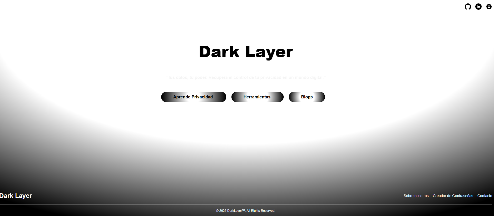
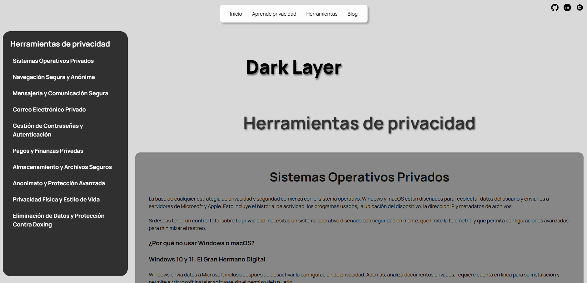
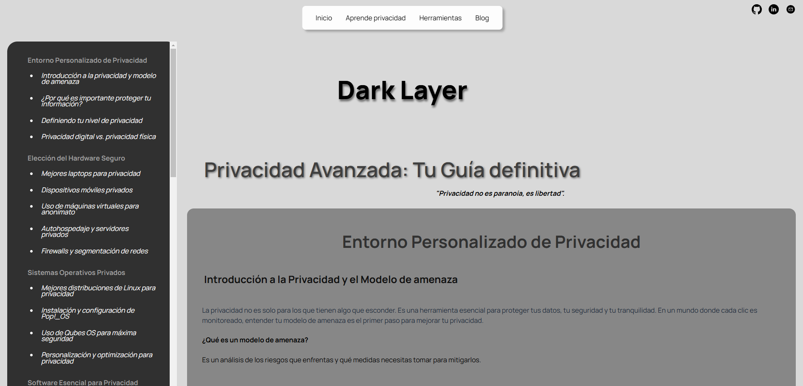
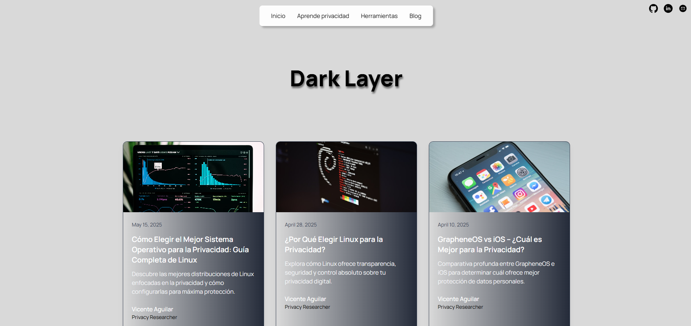

# DarkLayer™ - Plataforma de Privacidad y Anonimato

### 🌍 Proyecto de Protección Digital y Descentralización

---

## 📌 Descripción
**DarkLayer™** es una plataforma sin ánimo de lucro dedicada a proporcionar herramientas, recursos y guías para proteger la privacidad y anonimato en internet. La misión de este proyecto es ofrecer conocimiento gratuito y accesible sobre seguridad digital para cualquier persona que desee proteger su identidad y evitar la censura. Este proyecto está enfocado en crear un entorno donde la privacidad no sea un privilegio, sino un derecho garantizado.

---

## 🚀 ¿Cómo Funciona la App?
**DarkLayer™** se basa en un sistema simple pero poderoso que permite a los usuarios acceder a herramientas y guías de privacidad de forma intuitiva.

### 🔒 Características Principales
1. **Navegadores seguros** (Tor, Brave, etc.).
2. **VPNs confiables** (Mullvad, ProtonVPN).
3. **Generador de identidades anónimas.**
4. **Guías educativas** sobre cómo proteger la privacidad.
5. **Noticias y alertas de seguridad.**

### 📸 Screenshots







---

## 🔗 Enlaces al Proyecto
- [Repositorio del Proyecto](https://github.com/Vicent00/DarkLayer)
- [Página en Producción](https://dark-layer.vercel.app/)

---

## 📦 Cómo Desplegar
1. Clonar el repositorio:
```bash
  git clone https://github.com/tu-usuario/DarkLayer.git
```
2. Navegar al directorio del proyecto:
```bash
  cd DarkLayer
```
3. Instalar las dependencias:
```bash
  npm install
```
4. Iniciar el servidor de desarrollo:
```bash
  npm run dev
```
5. Acceder al proyecto en el navegador:
```
http://localhost:3000
```

### 📤 Despliegue en Producción
Para desplegar la aplicación en un servicio como **Vercel o Netlify**:
1. Crear un nuevo proyecto en la plataforma de despliegue.
2. Conectar el repositorio de GitHub.
3. Configurar la `build command` como:
```bash
npm run build
```
4. Configurar el `output directory` como:
```
dist
```
5. Desplegar y disfrutar de tu aplicación en producción.

---

## 💡 Futuras Implementaciones y Ideas
- 🔗 Integrar redes descentralizadas (IPFS, Nostr, Tor).
- 📱 Mejorar la experiencia responsiva para móviles.
- 📂 Añadir un sistema de foros encriptados.
- 📚 Crear un sistema interactivo de aprendizaje sobre privacidad.
- 💬 Implementar un chatbot anónimo basado en inteligencia artificial.

---

## ❓ FAQ (Preguntas Frecuentes)

### 📌 ¿Es esta plataforma completamente anónima?
Actualmente, la plataforma ofrece herramientas y guías para mejorar la privacidad. En el futuro, se integrarán sistemas descentralizados para garantizar anonimato absoluto.

### 📌 ¿Se recopilan datos personales de los usuarios?
No. DarkLayer™ no recopila ningún tipo de dato personal. Todo el contenido es accesible de forma gratuita y anónima.

### 📌 ¿Puedo contribuir al proyecto?
¡Por supuesto! Puedes hacer un fork del proyecto y enviar pull requests con tus mejoras.

### 📌 ¿Qué necesito para desplegarlo por mi cuenta?
Solamente necesitas Node.js, npm, y seguir los pasos indicados en la sección de despliegue.

---

## 📧 Contacto
¿Tienes alguna pregunta o sugerencia? Contacta al desarrollador en: **tu-email@ejemplo.com**

---

## 📜 Licencia
Este proyecto es de código abierto bajo la Licencia MIT.

